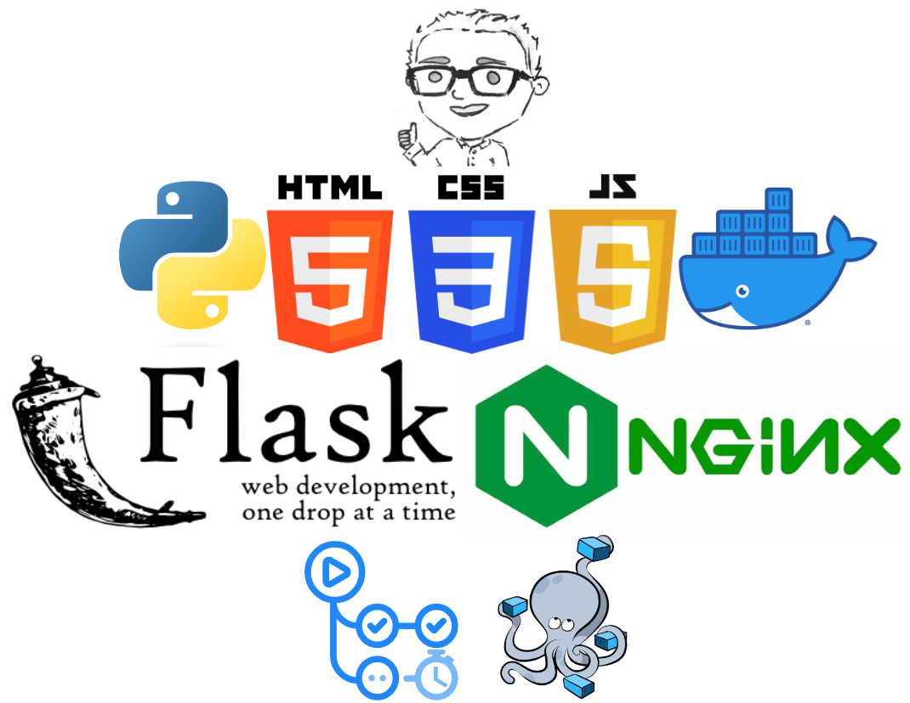
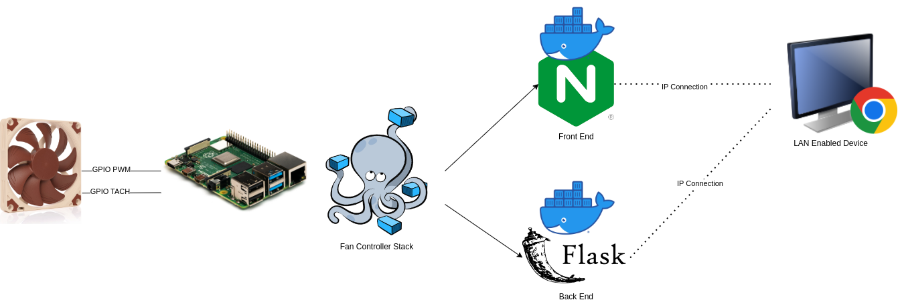

# Web Based Fan Controller

[](https://github.com/ScottGibb/Web-Based-Fan-Controller/actions/workflows/Static%20Analysis.yml)
[](https://github.com/ScottGibb/Web-Based-Fan-Controller/actions/workflows/Build.yml)
[](https://www.gnu.org/licenses/gpl-3.0)

<center>

</center>

## Summary

This project contains a very simple web based application for controlling a Fan. This was my first time creating a web app and as such is not the best app ever built. However it was done as an educational project to explore different aspects of web development. The project consists of both a backend and frontend component. The backend is written in Python and uses the Flask framework. The frontend is written in HTML and CSS and uses Bootstrap for styling. The backend and frontend are packaged together in a Docker compose file, the system is designed to run on a raspberry pi. However the frontend docker container can be moved to a seperate server if desired.


## Architecture

The architecture of the system is as follows:

<center>

</center>

## Installation

### Update Pins

Firstly, navigate to the `PythonWebApp/BackEnd/src` directory and open the `app.py` file. In this file you will need to update the constructor of FanController to the pins you have connected the fan to. The pin number should be the BCM pin number.

Once this is completed, save the file and close it.

### Build Docker Images through Docker Compose

Next, navigate to the `PythonWebApp` directory and run the following command:

```bash
docker-compose up -d --build
```
If you want to build the mock version of the backend, run the following command instead:

```bash
docker-compose up -d --build -e MOCK="mock"
```

After this the docker image will be built and the containers will be started. The web app should now be accessible at `http://server-ip:5001`.

### Build and run Docker Images Manually

Alternatively, you can build the docker images manually. To do this, navigate to the `PythonWebApp/BackEnd` directory and run the following command:

```bash
sh run.sh
```

The same can be done for the frontend by navigating to the `PythonWebApp/FrontEnd` directory and running the following command:

```bash
sh run.sh
```

## Continuous Integration

The project uses GitHub actions to perform continuous integration. The workflow is defined in the `.github/workflows folder

### Build

As part of the pipelines associated with this project is a build stage, Which builds the docker images for the backend and frontend. The build stage is defined in the `Build.yml` file. It also performs static analysis on the code using the following tools:

- shellcheck
- hadolint

This allows both dockerfiles to be validated and tested. This stage also tests the run scripts for both backend and frontend.


### Static Analysis

The static analysis stage is defined in the `Static Analysis.yml` file. It performs static analysis on the code using the following tools:
- pylint
- cslint
- eslint
- htmllint

This allows all the code associated with this project to be properly verified and kept up to certain standards.

## Useful Links

- [Flask](https://flask.palletsprojects.com/en/2.0.x/)
- [Bootstrap](https://getbootstrap.com/)
- [Docker](https://www.docker.com/)
